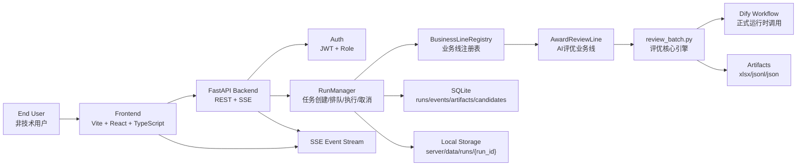
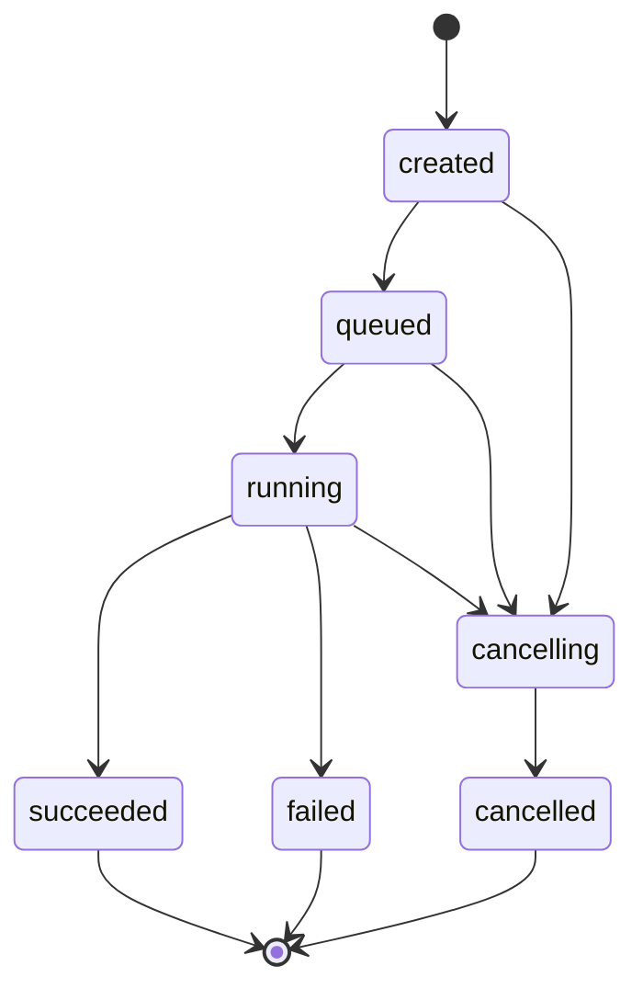

# TMOD智能员工：项目技术架构与 Context

生成时间：2026-06-19  
本地路径：`E:\工作文件夹\TMOD\6月评优\testing`  
GitHub 仓库：<https://github.com/291536210mdy-svg/tmod-smart-employee>  
当前提交：`b66defa Initial TMOD smart employee platform`

## 1. 项目一句话

`TMOD智能员工` 是一个面向团队业务线的智能体平台。第一条接入的业务线是 `AI评优`：用户上传评优源数据 Excel，系统自动执行评优批处理、排序、QA 校验、结果入库，并在前端以 chat-first 的方式呈现运行状态、候选结果和可下载产物。

## 2. 项目背景 Context

这个项目最初来自 2026 年 6 月评优工作的自动化需求。早期评优工作是一条单线脚本流程：读取源数据 Excel，调用 Dify Workflow 或 dry-run 逻辑，对候选主体进行评审、排序、生成排名理由、导出结果文件。

后来目标升级为“团队业务智能体平台”：评优只是第一条业务线，未来还可能接入其他团队业务线。平台外壳需要像 LambChat 一样工业化，普通非技术用户通过一个智能员工入口完成业务，而不是直接面对脚本、命令行、配置文件和输出目录。

当前产品名称与业务线名称约定：

- 平台总入口名称：`TMOD智能员工`
- 当前业务线智能体名称：`AI评优`
- 业务线名称映射位置：`review_platform/frontend/src/businessLineDisplay.ts`

## 3. 第一版产品边界

第一版目标是跑通完整闭环，而不是一次性上企业级全家桶。

已完成能力：

- 用户登录与角色识别。
- chat-first 前端外壳。
- 上传 Excel 发起评优任务。
- dry-run 与正式 Dify 调用参数分离。
- 运行任务后台执行。
- SSE 实时事件流。
- 运行状态、QA、候选结果、产物下载。
- 评优业务线作为平台插件式业务线接入。
- GitHub public 仓库发布。

暂不做或轻量处理：

- 不做复杂 RBAC，仅保留 `viewer`、`reviewer`、`admin`。
- 不接 SSO。
- 不接 Redis/Celery。
- 不接对象存储。
- 不上 PostgreSQL。
- 不上 Kubernetes。

原因：第一版的关键风险不是高并发，而是业务链路是否可复用、是否可解释、是否能让非技术用户顺利完成一次真实任务。

## 4. 总体架构



## 5. 仓库结构

```text
.
├── README.md
├── review_batch.py
├── award_config.json
├── sample_input.xlsx
├── review_platform/
│   ├── server/
│   │   ├── run_server.py
│   │   ├── requirements.txt
│   │   ├── .env.example.local
│   │   ├── .env.example.server
│   │   └── app/
│   │       ├── main.py
│   │       ├── api/
│   │       ├── core/
│   │       ├── db/
│   │       ├── platform/
│   │       └── lines/
│   │           └── award_review/
│   └── frontend/
│       ├── package.json
│       ├── vite.config.ts
│       └── src/
│           ├── App.tsx
│           ├── businessLineDisplay.ts
│           ├── api/
│           ├── components/
│           ├── hooks/
│           └── pages/
└── *.md
```

关键说明：

- `review_batch.py` 是评优业务核心。它仍然可以作为 CLI 脚本运行，也已经被抽象出 `run_review_batch()` 供后端调用。
- `review_platform/server` 是平台后端。
- `review_platform/frontend` 是平台前端。
- `outputs/`、`server/data/`、`.env`、`node_modules/`、`dist/` 均被 `.gitignore` 排除。

## 6. 技术栈

前端：

- Vite
- React
- TypeScript
- Tailwind CSS
- lucide-react
- react-router-dom
- `@microsoft/fetch-event-source`

后端：

- FastAPI
- SQLAlchemy
- SQLite
- Pydantic / pydantic-settings
- passlib + bcrypt
- python-jose JWT
- ThreadPoolExecutor

评优核心：

- Python
- Excel 读写
- Dify Workflow API
- 本地 dry-run 逻辑
- 本地固定优先级规则

## 7. 前端架构

前端入口：

- `review_platform/frontend/src/main.tsx`
- `review_platform/frontend/src/App.tsx`

核心页面：

- `/login`：登录页。
- `/`：chat-first 工作台，当前业务线为 `AI评优`。
- `/lines`：业务线列表。
- `/runs`：运行记录。
- `/runs/:runId`：运行详情。

核心组件：

- `components/Shell.tsx`：LambChat 风格窄侧栏、顶部平台名称、侧边面板。
- `pages/ChatWorkspacePage.tsx`：AI评优主入口。
- `pages/RunDetailPage.tsx`：运行详情、QA、产物、候选结果、事件日志。
- `hooks/useRunEvents.ts`：SSE 事件订阅。
- `api/client.ts`：统一 API 客户端。

前端命名配置：

```ts
export const PLATFORM_DISPLAY_NAME = "TMOD智能员工";
export const CURRENT_BUSINESS_LINE_ID = "award_review";

const businessLineAgentNames: Record<string, string> = {
  award_review: "AI评优"
};
```

以后新增业务线时，这里可以补充业务线 ID 到展示名称的映射。

## 8. 后端架构

后端入口：

- `review_platform/server/run_server.py`
- `review_platform/server/app/main.py`

后端分层：

- `app/core`：配置、路径、安全、日志。
- `app/db`：数据库连接、模型、初始化。
- `app/api`：REST/SSE 路由与序列化。
- `app/platform`：平台抽象，包括业务线协议、注册表、运行管理、事件、产物、存储。
- `app/lines/award_review`：AI评优业务线适配层。

核心运行对象：

- `RunManager`：创建任务、提交任务、取消任务、执行任务、写入状态、写入 summary。
- `BusinessLineRegistry`：业务线注册表。
- `BusinessLineManifest`：业务线声明。
- `RunContext`：业务线运行上下文。
- `ArtifactStore`：产物登记与下载路径解析。
- `EventBus`：事件持久化与 SSE 查询。
- `LocalStorage`：本地运行目录管理。

## 9. 业务线抽象

平台层通过协议隔离不同业务线。

`BusinessLineManifest` 描述业务线：

- `line_id`
- `name`
- `description`
- `input_types`
- `run_modes`
- `artifacts`
- `config_schema`
- `supports_events`
- `supports_result_query`
- `supports_export`

`RunContext` 提供业务线运行所需上下文：

- `run_id`
- `line_id`
- `config`
- `input_dir`
- `output_dir`
- `settings`
- `emit`
- `add_artifact`
- `should_cancel`
- `summary`

这意味着未来新增业务线时，不需要重写平台层，只需要新增：

```text
review_platform/server/app/lines/{new_line}/
├── line.py
├── runner.py
├── schemas.py
└── adapter.py
```

## 10. AI评优业务线

业务线目录：

```text
review_platform/server/app/lines/award_review/
├── adapter.py
├── ingest.py
├── line.py
├── runner.py
├── schemas.py
└── README.md
```

运行配置模型：`AwardReviewRunConfig`

字段：

- `dry_run: bool`
- `award_filters: list[str]`
- `limit: int`
- `timeout: int`
- `sleep: float`
- `enable_leadership_priority: bool`
- `input_filename: str = "source.xlsx"`

业务适配流程：

1. 后端收到上传文件，保存为 `run/input/source.xlsx`。
2. `RunManager` 找到 `award_review` 业务线。
3. `AwardReviewRunner` 调用 `adapter.run_award_review()`。
4. `adapter.py` 把平台上下文转换为 `review_batch.ReviewBatchConfig`。
5. 调用 `review_batch.run_review_batch()`。
6. 将输出文件登记为平台产物。
7. 读取 internal pack，写入 `candidate_results` 表。
8. 将 QA、处理数量、奖项统计写入 run summary。

## 11. 评优核心引擎

核心文件：`review_batch.py`

第一版平台化前，它是一个 CLI 脚本。现在它保留 CLI 能力，同时新增了可被后端调用的函数式入口。

核心对象：

- `ReviewBatchConfig`
- `ReviewBatchResult`
- `EventSink`
- `NullEventSink`
- `RunCancelled`
- `run_review_batch(config, event_sink=None, should_cancel=None)`

核心事件：

- `excel:loaded`
- `candidate:started`
- `candidate:reviewed`
- `candidate:failed`
- `ranking:started`
- `ranking:done`
- `reason:started`
- `reason:done`
- `export:started`
- `artifact:created`
- `qa:started`
- `qa:done`

输出产物：

- `review_results_xlsx`
- `raw_review_jsonl`
- `internal_review_pack`
- `completion_xlsx`
- `qa_report`

## 12. 固定优先级 Context

之前复宏汉霖、复星健康的领导优先级来自本地 xlsx。后续用户要求改为本地固定逻辑，不再依赖这些 xlsx。

当前规则目标：

- 在指定申报项目下，优先级是槽位内重排逻辑。
- 优先级在这些场景中作为最重要标准。
- 权重改为 100%。
- 证据匹配程度仍按真实评审结果表达，不在文案上露出人为操控痕迹。

复宏汉霖：

- `全球业务突破奖 Global Business Breakthrough Award`
  - `复宏汉霖 -药政注册部`
  - `复宏汉霖  全球产品开发部`
  - `复宏汉霖  HLX11项目组`
  - `复宏汉霖商务拓展部`
  - `复宏汉霖 税务团队`
- `AI价值领航奖 AI Value Navigator Award`
  - `复宏汉霖 全球创新中心`
  - `复宏汉霖 数智创新部`

复星健康：

- `企业经营乘长奖 Corporate Transformational Growth Award`
  - `上海星晨儿童医院`
  - `宿迁钟吾医院院委会`
- `AI价值领航奖 AI Value Navigator Award`
  - `广州复星禅诚医院`
  - `中国药科大学附属重庆星荣整形外科医院新媒体营销部`

前端参数中 `enable_leadership_priority` 用于控制是否启用该规则，默认开启。

## 13. 数据库设计

当前数据库：SQLite。默认路径：

```text
review_platform/server/data/app.db
```

正式部署可通过 `DATABASE_URL` 替换。

主要表：

| 表 | 作用 |
|---|---|
| `users` | 用户、角色、密码哈希 |
| `business_lines` | 已注册业务线 |
| `runs` | 运行任务主表 |
| `run_events` | 运行事件 |
| `artifacts` | 产物元数据 |
| `candidate_results` | 候选评优结果 |
| `manual_actions` | 预留人工操作审计 |

`runs` 关键字段：

- `run_id`
- `line_id`
- `status`
- `title`
- `config_json`
- `input_files_json`
- `output_dir`
- `created_by`
- `created_at`
- `started_at`
- `finished_at`
- `error_message`
- `summary_json`
- `cancel_requested`

`candidate_results` 关键字段：

- `run_id`
- `candidate_id`
- `excel_row`
- `award_name`
- `subject`
- `rank`
- `recommendation_status`
- `workflow_status`
- `normal_review_score`
- `internal_score`
- `manual_review_required`
- `ranking_reason`
- `raw_json`

## 14. 运行状态机



状态说明：

- `created`：任务已创建。
- `queued`：任务已入队。
- `running`：任务执行中。
- `cancelling`：用户请求取消。
- `succeeded`：执行成功。
- `failed`：执行失败。
- `cancelled`：已取消。

## 15. API 设计

鉴权：

| 方法 | 路径 | 说明 |
|---|---|---|
| `POST` | `/api/auth/login` | 登录，返回 JWT |
| `GET` | `/api/auth/me` | 当前用户 |
| `POST` | `/api/auth/users` | 创建用户，仅 admin |

业务线：

| 方法 | 路径 | 说明 |
|---|---|---|
| `GET` | `/api/business-lines` | 业务线列表 |
| `GET` | `/api/business-lines/{line_id}` | 业务线详情 |

运行：

| 方法 | 路径 | 说明 |
|---|---|---|
| `POST` | `/api/runs` | 创建并提交运行，multipart 上传 |
| `GET` | `/api/runs` | 运行列表 |
| `GET` | `/api/runs/{run_id}` | 运行详情 |
| `POST` | `/api/runs/{run_id}/cancel` | 取消运行 |
| `GET` | `/api/runs/{run_id}/events` | 事件列表 |
| `GET` | `/api/runs/{run_id}/events/stream` | SSE 事件流 |

产物：

| 方法 | 路径 | 说明 |
|---|---|---|
| `GET` | `/api/runs/{run_id}/artifacts` | 产物列表 |
| `GET` | `/api/runs/{run_id}/artifacts/{artifact_id}/download` | 下载产物 |

候选结果：

| 方法 | 路径 | 说明 |
|---|---|---|
| `GET` | `/api/runs/{run_id}/candidates` | 候选结果列表 |
| `GET` | `/api/runs/{run_id}/candidates/{candidate_id}` | 候选明细 |
| `GET` | `/api/runs/{run_id}/qa-report` | QA 报告 |

权限约束：

- `viewer`：可登录、看业务线、看运行状态。
- `reviewer`：可提交任务、查看候选、下载产物。
- `admin`：包含 reviewer 能力，并可创建用户。

## 16. SSE 事件流

前端用 `@microsoft/fetch-event-source` 连接：

```text
GET /api/runs/{run_id}/events/stream?after_id={last_event_id}
```

后端从 `run_events` 表轮询新事件，并按 SSE 格式返回：

```text
id: 123
event: candidate:reviewed
data: {...}
```

当任务进入 `succeeded`、`failed`、`cancelled` 且没有新事件时，流结束。

## 17. 文件与产物存储

本地运行数据目录：

```text
review_platform/server/data/
```

单次运行目录结构：

```text
data/runs/{run_id}/
├── input/
│   └── source.xlsx
└── output/
    ├── review_results_*.xlsx
    ├── review_results_*.jsonl
    ├── internal_review_pack_*.jsonl
    ├── completion_*.xlsx
    └── qa_report_*.json
```

GitHub 仓库不会提交 `server/data/`。

## 18. 本地启动

后端：

```powershell
cd E:\工作文件夹\TMOD\6月评优\testing\review_platform\server
pip install -r requirements.txt
python run_server.py
```

前端：

```powershell
cd E:\工作文件夹\TMOD\6月评优\testing\review_platform\frontend
npm install
npm run dev -- --host 127.0.0.1 --port 5173
```

访问：

- 前端：<http://127.0.0.1:5173>
- 后端健康检查：<http://127.0.0.1:8000/api/health>

默认本地账号：

- 用户名：`admin`
- 密码：`admin123`

## 19. 环境变量

示例文件：

- `review_platform/server/.env.example.local`
- `review_platform/server/.env.example.server`

关键变量：

```text
APP_HOST=0.0.0.0
APP_PORT=8000
APP_DATA_DIR=./data
DATABASE_URL=
SECRET_KEY=
PUBLIC_BASE_URL=
DIFY_BASE_URL=
DIFY_REVIEW_WORKFLOW_API_KEY=
DIFY_RANKING_REASON_WORKFLOW_API_KEY=
DIFY_USER=review-platform
RUN_MAX_WORKERS=2
ACCESS_TOKEN_EXPIRE_MINUTES=720
SEED_ADMIN_USERNAME=admin
SEED_ADMIN_PASSWORD=
```

正式部署前必须修改：

- `SECRET_KEY`
- `SEED_ADMIN_PASSWORD`
- Dify 相关 API Key

## 20. 部署思路

第一版适合云服务器直接部署：

```text
Nginx
├── /               -> frontend static build
└── /api            -> FastAPI backend
```

推荐第一版部署方式：

1. 购买一台云服务器。
2. 安装 Python、Node.js、Nginx。
3. 后端用 systemd 或进程管理器常驻运行。
4. 前端执行 `npm run build`，将 `dist/` 交给 Nginx 托管。
5. Nginx 将 `/api` 反向代理到 FastAPI。
6. `.env` 放在服务器，不提交 GitHub。
7. 定期备份 `server/data/app.db` 和 `server/data/runs/`。

第二阶段再考虑：

- PostgreSQL
- Redis/Celery
- 对象存储
- SSO
- 更复杂 RBAC
- Kubernetes

## 21. 安全与公开仓库处理

已排除不进入 public repo：

- `.env`
- `outputs/`
- `review_platform/server/data/`
- SQLite 数据库
- `node_modules/`
- `frontend/dist/`
- Python `__pycache__`
- TypeScript build info

public repo 中只保留：

- 源码
- 示例配置
- 项目文档
- 非敏感示例文件

注意：正式环境不应使用默认 `admin/admin123`，必须替换 `SEED_ADMIN_PASSWORD` 并使用强 `SECRET_KEY`。

## 22. 设计取舍

为什么第一版用 SQLite：

- 单机部署即可满足第一版使用场景。
- 易备份，易迁移。
- 任务量不是第一阶段主要瓶颈。

为什么不用 Celery：

- 当前任务并发由 `ThreadPoolExecutor` 控制。
- 复杂队列会增加部署门槛。
- 第一版更需要验证业务链路与用户体验。

为什么不用对象存储：

- 产物体积可控。
- 本地文件路径与 SQLite 元数据足够支撑第一版。
- 后续可将 `ArtifactStore` 换成对象存储实现。

为什么采用业务线抽象：

- 评优不是唯一业务。
- 平台层负责通用能力，业务线只关心自己的输入、运行和产物。
- 未来新增业务线时，前端、后端、DB、事件流都可以复用。

## 23. 已验证内容

已执行过的验证：

- `python -m compileall review_batch.py review_platform/server/app review_platform/server/run_server.py`
- `npm run build`
- 后端 `/api/health`
- 前端 Vite 访问
- 通过前端代理登录
- 通过前端代理提交 dry-run 任务
- 产物列表和候选结果接口可返回
- GitHub public repo 创建与 push

## 24. 后续开发建议

短期建议：

1. 增加一键部署 README。
2. 增加端到端 Playwright 测试。
3. 增加用户管理 UI。
4. 增加运行任务的删除/归档能力。
5. 增加更清晰的 QA 报告展示。
6. 增加业务线配置页面，让 `AI评优` 这类名称不再写在前端代码中。

中期建议：

1. 将 SQLite 迁移到 PostgreSQL。
2. 将本地文件产物迁移到对象存储。
3. 将 ThreadPoolExecutor 迁移到 Celery/RQ。
4. 引入 SSO。
5. 引入审计日志和更细粒度权限。
6. 将业务线 registry 做成可配置或插件化加载。

## 25. 给后续接手者的重点提醒

- 不要把 `.env`、`server/data/`、`outputs/` 推到 GitHub。
- 不要在前端保存或展示 Dify API Key。
- 正式运行必须配置 Dify Key；dry-run 可以不配置。
- `review_batch.py` 仍是评优核心，平台层只是包装和编排。
- 新业务线优先复用 `BusinessLineManifest`、`RunContext`、`RunManager`。
- 非技术用户不应看到技术参数太多，当前前端已尽量将复杂内容收进详情页和侧边面板。
