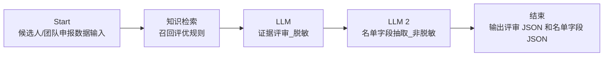

# 已完成 Dify Workflow 流程说明

生成时间：2026-06-08  
适用项目：2025 年度评优辅助智能体  
Dify App：评优候选人评审工作流

## 1. 当前完成状态

当前 Dify Workflow 已搭建、测试并发布。

已完成事项：

- 已创建 Workflow App。
- 已配置 Start 输入字段。
- 已接入评优规则知识库检索。
- 已配置第一段 LLM 节点，用于证据评审。
- 已配置第二段 LLM 节点，用于最终名单字段抽取。
- 已配置结束节点输出变量。
- 已使用一条模拟数据完成测试运行。
- 测试追踪显示 5 个节点全部执行成功。
- 已点击发布，页面显示“操作成功 / 已发布”。

## 2. Workflow 总体结构

当前工作流结构如下：



说明：

- Dify 画布内部节点名当前仍显示为 `LLM` 和 `LLM 2`。
- 这两个节点的职责通过节点描述和 Prompt 区分。
- 后续 Python 调用 Workflow 时，结束节点已经把两个 LLM 输出映射成稳定输出变量。

## 3. Start 节点输入字段

Start 节点已配置 7 个输入字段。

| 字段名 | 类型 | 用途 |
|---|---|---|
| `candidate_id` | 文本 | 候选记录 ID |
| `batch_id` | 文本 | 申报批次 |
| `award_name` | 文本 | 申报奖项名称 |
| `award_type` | 文本 | 奖项类型，如团队奖、个人奖 |
| `submission_reason_masked` | 段落 | 脱敏后的申报理由，用于证据评审 |
| `submission_reason_full` | 段落 | 原始完整申报理由，用于名单字段抽取 |
| `raw_row_json` | 段落 | Excel 原始行 JSON，用于还原表格字段 |

设计意图：

- `submission_reason_masked` 用于评分和证据判断，降低姓名、部门、职级等信息对评审的干扰。
- `submission_reason_full` 和 `raw_row_json` 只用于最终名单字段抽取，不参与评分判断。
- 这样可以把“评审判断”和“名单字段还原”拆开，减少偏差。

## 4. 知识检索节点

知识检索节点已接入知识库：

- `2025年度评优规则_知识库版.md...`

用途：

- 根据候选人申报奖项和申报理由召回相关评优规则。
- 为后续证据评审 LLM 提供规则依据。

当前链路中，第一段 LLM 的上下文已绑定到：

```text
知识检索.result
```

注意：

- 当前知识库已经使用 Dify 里的 embedding / rerank 能力。
- 也就是说，embedding 和 rerank 主要发生在“知识检索节点”阶段，而不是 Python 本地。
- Python 后续只负责传入 Excel 行数据、调用 Workflow、接收结果、校验 JSON、写回 Excel。

## 5. 第一段 LLM：证据评审

Dify 内部节点名：

```text
LLM
```

业务职责：

```text
证据评审_脱敏
```

节点描述：

```text
根据召回规则与脱敏申报理由输出证据等级 JSON，不决定获奖、不输出总分。
```

输入来源：

- `candidate_id`
- `award_name`
- `award_type`
- `submission_reason_masked`
- `知识检索.result`

输出变量：

```text
LLM.text
```

在结束节点中映射为：

```text
review_result_json
```

核心要求：

- 只依据申报理由和召回的评优规则。
- 不根据姓名、部门、推荐人、职级做加权判断。
- 不编造输入中没有出现的事实。
- 输出严格 JSON。
- `grade` 只能为 `strong`、`medium`、`weak`、`missing`。

目标 JSON 结构：

```json
{
  "schema_version": "review_v1",
  "candidate_id": "",
  "award_name": "",
  "evidence_grades": {
    "rule_match": {"grade": "", "reason": "", "evidence": ""},
    "quantitative": {"grade": "", "reason": "", "evidence": ""},
    "value_impact": {"grade": "", "reason": "", "evidence": ""},
    "innovation": {"grade": "", "reason": "", "evidence": ""},
    "strategy_align": {"grade": "", "reason": "", "evidence": ""}
  },
  "matched_rules": [],
  "missing_evidence": [],
  "risk_flags": [],
  "explanation": ""
}
```

## 6. 第二段 LLM：名单字段抽取

Dify 内部节点名：

```text
LLM 2
```

业务职责：

```text
名单字段抽取_非脱敏
```

节点描述：

```text
从 Excel 原始行和完整申报理由中抽取最终名单表字段，不负责评奖、不输出分数。
```

输入来源：

- `raw_row_json`
- `submission_reason_full`

输出变量：

```text
LLM 2.text
```

在结束节点中映射为：

```text
final_fields_json
```

核心要求：

- 不编造负责人和成员。
- 如果团队负责人或团队成员无法明确识别，填“待补充”。
- 事迹必须忠于原文，适合放入最终评优名单表。
- 不负责评奖，不输出分数。
- 输出严格 JSON。

目标 JSON 结构：

```json
{
  "schema_version": "final_fields_v1",
  "subject": "",
  "submitter": "",
  "team_leader": "",
  "team_members": "",
  "achievement": "",
  "needs_completion": [],
  "field_confidence": {
    "subject": "high|medium|low",
    "submitter": "high|medium|low",
    "team_leader": "high|medium|low",
    "team_members": "high|medium|low",
    "achievement": "high|medium|low"
  }
}
```

## 7. 结束节点输出

结束节点已配置两个输出变量：

| 输出变量 | 来源 | 用途 |
|---|---|---|
| `review_result_json` | `LLM.text` | 证据评审结果 JSON |
| `final_fields_json` | `LLM 2.text` | 最终名单字段抽取 JSON |

后续 Python 调用 Workflow 时，应优先读取这两个输出字段。

## 8. 已完成测试

已使用一条模拟数据执行测试。

测试数据为虚构数据，不包含真实员工隐私。

测试结果：

- Workflow 状态：`SUCCESS`
- 运行步数：5
- 节点执行情况：
  - Start：成功
  - 知识检索：成功
  - LLM：成功
  - LLM 2：成功
  - 结束：成功
- 总 token 数：约 556 tokens
- 运行耗时：约 3.811 秒

说明：

- 测试证明当前 Workflow 链路已经能完整跑通。
- 由于测试是在 Dify 页面内运行，后续仍需要用 Workflow API 再做一次本地 Python 调用测试。

## 9. 后续 Python 对接方式

Python 本地脚本后续要做的事情：

1. 读取 Excel。
2. 对每一行构造 Dify Workflow 输入。
3. 调用 Dify Workflow API。
4. 读取返回的 `review_result_json` 和 `final_fields_json`。
5. 校验两个字段是否为合法 JSON。
6. 将结果写回 Excel / JSON 文件。
7. 保留人工复核字段，不直接自动决定最终获奖。

Python 请求输入示例：

```json
{
  "inputs": {
    "candidate_id": "T001",
    "batch_id": "2025-test",
    "award_name": "优秀小组",
    "award_type": "团队奖",
    "submission_reason_masked": "脱敏后的申报理由",
    "submission_reason_full": "完整原始申报理由",
    "raw_row_json": "{\"申报项目\":\"优秀小组\",\"团队负责人\":\"张三\"}"
  },
  "response_mode": "blocking",
  "user": "local-review-script"
}
```

Python 侧预期读取：

```json
{
  "review_result_json": "...",
  "final_fields_json": "..."
}
```

## 10. API Key 注意事项

后续需要在该 Dify App 的“访问 API”页面创建或确认 Workflow App 专属 API Key。

注意：

- 这个 API Key 不是现有 `.env` 里的通用 `DIFY_API_KEY`。
- 需要使用“评优候选人评审工作流”这个 App 自己的 API Key。
- 不要把 API Key 写入代码。
- 可以放入本地 `.env`，例如：

```env
DIFY_BASE_URL=https://console-dify-aws.fosunpharma.com/v1
DIFY_REVIEW_WORKFLOW_API_KEY=这里填评优Workflow专属APIKey
```

## 11. 当前需要注意的小问题

当前 Dify 画布里两个 LLM 节点仍显示为：

- `LLM`
- `LLM 2`

但业务含义已经明确：

- `LLM` = 证据评审_脱敏
- `LLM 2` = 名单字段抽取_非脱敏

结束节点输出变量已经做了稳定映射，所以后续 Python 不需要依赖节点中文名，只需要读取：

- `review_result_json`
- `final_fields_json`

另外，第一段 LLM 已绑定 `知识检索.result` 作为上下文。后续如果要进一步优化，可以在 Dify 里把 Prompt 中的规则引用统一调整为 `{{context}}`，让上下文提示更符合 Dify 推荐写法。但当前测试链路已经成功跑通。


