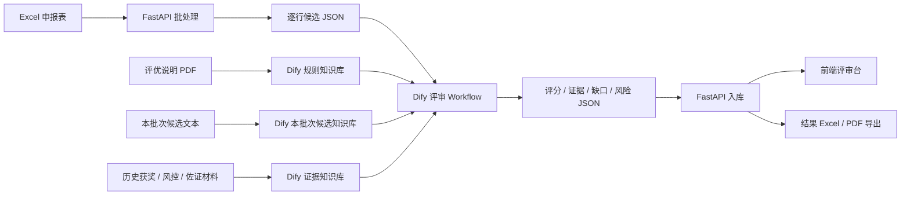

# 评优辅助智能体技术路线与架构设计

## 1. 总体判断

DeepSearch Agents 项目值得借鉴，但不建议照搬 DeepAgents 作为第一版核心框架。

我们的方向应是：

- 借鉴它的工程骨架；
- 核心智能能力仍放在 Dify；
- 通过 FastAPI/Python 做批处理、任务编排、结果入库和前端交互；
- 使用企业内的 LLM、text-embedding、rerank 模型，保护公司隐私。

## 2. 最可借鉴的设计

### 2.1 一主多从的分工模式

DeepSearch Agents 是“主智能体 + 网络搜索助手 + 数据库助手 + RAGFlow 助手”。

我们可以改成：

- 主评审编排器：FastAPI/Python
- 规则检索助手：Dify 评优规则知识库
- 申报理解助手：Dify Workflow LLM 节点
- 证据检索助手：Dify Knowledge Retrieval，使用 embedding + rerank
- 重复申报助手：本批次候选语义检索 + rerank
- 报告生成助手：生成评审摘要、结果 Excel、候选评审卡

### 2.2 多来源检索，而不是模型裸评

DeepSearch 强调查网络、查数据库、查私有知识库、读上传文件。

我们对应成：

- Excel 申报表
- 评优说明 PDF
- 本批次所有候选申报理由
- 历史获奖名单，后期补
- 风控筛查结果，后期补
- 佐证材料，后期补

### 2.3 长任务可观察

DeepSearch 用 FastAPI + WebSocket 把工具调用、子智能体调用、最终结果推给前端。

评优跑一批 Excel 不是秒级任务，前端应该能看到：

- 当前处理到第几条
- 正在检索哪个奖项规则
- 是否发现重复申报
- 是否评分失败
- 哪些候选需要人工复核

### 2.4 会话与任务隔离

DeepSearch 用 `thread_id` 和 `session_dir` 隔离每次任务。

我们应该使用：

- `batch_id`：一批评优 Excel
- `run_id`：一次评审执行
- `candidate_id`：单个候选
- `workflow_run_id`：Dify 返回的执行 ID

### 2.5 文件交付链路

DeepSearch 有上传、读取、生成 Markdown/PDF、下载文件。

我们可以改成上传 Excel/PDF，输出：

- `review_result.xlsx`
- `candidate_review_cards.json`
- `missing_evidence.xlsx`
- `duplicate_risk.xlsx`
- 评审会摘要 Markdown/PDF

## 3. 结合 Dify 的推荐架构



## 4. Dify Workflow 中 embedding 和 rerank 的位置

候选输入：

```text
申报项目 + 申报主体 + 姓名 + 职务 + 申报理由
```

### 4.1 知识检索 1：评优规则知识库

- embedding 召回相关奖项规则；
- rerank 精排最相关标准。

### 4.2 知识检索 2：本批次候选知识库

- embedding 找相似申报；
- rerank 判断是否疑似同一成果重复申报。

### 4.3 知识检索 3：历史获奖、风控、佐证材料知识库

- 后期接入；
- 用于发现历史重复获奖、风控风险、证据缺失或材料支撑。

### 4.4 LLM 节点输出结构化 JSON

建议输出：

- 规则命中
- 量化证据
- 缺失材料
- 重复风险
- 建议评分
- 入围建议
- 人工复核点

## 5. 技术路线

### 5.1 第一阶段：脚本版离线评审

第一阶段不是只做 Python 调 Dify，而是：

1. Python 解析 Excel/PDF。
2. FastAPI 暂时可不做，先用脚本。
3. PDF 规则导入 Dify 知识库。
4. 本批次 Excel 每行转成候选文本，也导入一个“本批次候选知识库”。
5. Python 逐行调用 Dify Workflow API。
6. Dify 内部用企业 LLM / embedding / rerank。
7. Python 汇总输出 Excel/JSON。

### 5.2 第二阶段：接入 FastAPI

建议接口：

- `POST /review-batches/upload`
- `POST /review-runs/start`
- `GET /review-runs/{run_id}/status`
- `GET /candidates/{candidate_id}`
- `POST /candidates/{candidate_id}/approve`
- `GET /exports/{run_id}`

### 5.3 第三阶段：前端评审台

前端 UI 可以借鉴 DeepSearch 的事件流，但界面改成评审台：

- 候选列表
- 候选详情
- 规则命中
- 证据摘要
- 缺失材料
- 重复申报风险
- 人工复核点
- 评委改分、备注、锁定最终意见

## 6. 不建议照搬的部分

- 不建议引入 DeepAgents 作为第一版核心框架，Dify Workflow 已经能承担评审流程。
- 不需要 Tavily 网络搜索，评优材料涉及隐私，默认不要出内网。
- 不需要 RAGFlow，因为已经有 Dify 知识库和企业 embedding/rerank。
- 不要用内存状态做生产任务，后期要落数据库。
- 不要让模型直接决定获奖，只给“辅助建议 + 证据 + 风险”。

## 7. 最值得读的章节

- 第 8 章：项目总览与工程初始化
- 第 9 章：模型配置、上下文、monitor、路径工具
- 第 12 章：RAGFlow 子智能体，可迁移成 Dify 知识库思路
- 第 13 章：主智能体、上传文件读取、文件交付
- 第 14 章：FastAPI、WebSocket、前后端闭环
- 第 5 章：人机协作与中断恢复，对评委人工复核很有启发
- 第 7 章：中间件与治理，对调用限制、工具限制、审计有启发

## 8. 参考链接

- [deepsearch-agents README](https://github.com/didilili/deepsearch-agents)
- [main_agent.py](https://github.com/didilili/deepsearch-agents/blob/main/app/agent/main_agent.py)
- [server.py](https://github.com/didilili/deepsearch-agents/blob/main/app/api/server.py)
- [Dify Knowledge Retrieval](https://docs.dify.ai/en/guides/workflow/node/knowledge-retrieval)
- [Dify Run Workflow API](https://docs.dify.ai/api-reference/workflows/run-workflow)
