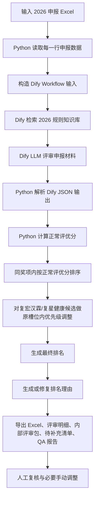

# 2026 年中评优智能辅助流程说明

生成日期：2026-06-16  
适用场景：复星集团 2026 年中评优申报材料评审、排序、排名理由生成与人工复核  
当前工作目录：`E:\工作文件夹\TMOD\6月评优\testing`

## 一、背景

本轮工作是基于 2026 年中评优实战数据，搭建并验证一套从申报 Excel 到评选结果 Excel 的半自动化评审流程。流程的核心目标不是替代人工决策，而是把材料读取、规则匹配、证据提取、初步排序、排名理由生成、QA 校验等重复性工作标准化，帮助评审人员更快形成可复核、可解释的拟推荐结果。

本轮与 2025 年演练相比，发生了几项关键变化：

1. 规则来源切换  
   2025 年规则库不再作为本轮主要依据，Dify Workflow 的规则知识检索节点应改用 2026 年规则源，即：
   `E:\工作文件夹\TMOD\6月评优\2026实战\2026集团年中评优奖项及标准.docx`

2. 输入字段发生调整  
   2026 年申报表字段标题与 2025 年存在差异。本轮按 2026 实战数据适配，当前实战输入文件为：
   `E:\工作文件夹\TMOD\6月评优\2026实战\0616v2hr.award.application (1).xlsx`

3. 输出字段发生调整  
   输出表中保留并新增“所属PL”，放在“所属BU”之后；“所属BG/AMC”忽略；“团队成员”不再输出。

4. 新增领导优先级参考  
   对复宏汉霖、复星健康等特定主体，新增内部优先级作为辅助参考。该优先级只用于同一主体来源、同一奖项内部候选的排序微调，不允许直接挤占其他公司或其他主体原本靠前的位置。

5. 排名理由要求提升  
   排名理由不能只写固定话术，例如“结合复宏汉霖内部战略优先级”。对于涉及内部优先级的项目，也必须像普通候选一样说明项目事实、量化结果、奖项匹配度和排序原因，再补充内部优先级口径。

## 二、总体流程

当前流程可以概括为：



## 三、数据基础建设

### 1. 主要输入文件

| 类型 | 文件 |
|---|---|
| 2026 申报数据 | `E:\工作文件夹\TMOD\6月评优\2026实战\0616v2hr.award.application (1).xlsx` |
| 2026 奖项规则 | `E:\工作文件夹\TMOD\6月评优\2026实战\2026集团年中评优奖项及标准.docx` |
| 复宏汉霖优先级 | `E:\工作文件夹\TMOD\6月评优\2026实战\汉霖优先级.xlsx` |
| 复星健康优先级 | `E:\工作文件夹\TMOD\6月评优\2026实战\复星健康优先级.xlsx` |
| 输出格式模板 | `E:\工作文件夹\TMOD\6月评优\testing\评选结果输出格式.xlsx` |

### 2. 主要程序与配置

| 类型 | 文件 |
|---|---|
| 批量评审主程序 | `E:\工作文件夹\TMOD\6月评优\testing\review_batch.py` |
| 奖项名额与权重配置 | `E:\工作文件夹\TMOD\6月评优\testing\award_config.json` |
| 手动排名修正脚本 | `E:\工作文件夹\TMOD\6月评优\testing\apply_manual_rank_patch.py` |

### 3. 主要输出文件

| 类型 | 文件 |
|---|---|
| 评选结果 Excel | `outputs\2026_v2hr_full_run\2026评优v2.xlsx` |
| 手动调整版 Excel | `outputs\2026_v2hr_full_run\2026评优v2_手动调整版.xlsx` |
| 原表备份 | `outputs\2026_v2hr_full_run\2026评优v2_修改前备份.xlsx` |
| Dify 调用原始结果 | `outputs\2026_v2hr_full_run\review_results_20260616_163601.jsonl` |
| 内部评审包 | `outputs\2026_v2hr_full_run\internal_review_pack_20260616_163601.jsonl` |
| 待补充清单 | `outputs\2026_v2hr_full_run\待补充清单_20260616_163601.xlsx` |
| QA 报告 | `outputs\2026_v2hr_full_run\qa_report_20260616_163601.json` |
| 手动调整记录 | `outputs\2026_v2hr_full_run\manual_rank_patch_report_20260616.json` |

## 四、技术路线

### 1. Dify Workflow 层

Dify 负责完成“规则检索”和“材料证据评审”两件事。

第一步是知识检索。Workflow 的知识库节点应使用 2026 年奖项规则源。检索方式可以使用向量检索或混合检索；当前截图中使用的是 `bge-m3` Embedding、`bge-reranker-large` Rerank，并设置 Top K 和 Score 阈值，用于从 2026 规则源里召回与申报奖项最相关的标准描述。

第二步是 LLM 证据评审。Dify 接收 Python 传入的候选行数据，包括申报奖项、奖项类型、申报理由、原始行 JSON 等，结合检索到的 2026 奖项规则，输出结构化 JSON。核心输出包括：

```json
{
  "schema_version": "review_v1",
  "candidate_id": "",
  "award_name": "",
  "evidence_grades": {
    "rule_match": {"grade": "", "reason": "", "evidence": ""},
    "quantitative": {"grade": "", "reason": "", "evidence": ""},
    "value_impact": {"grade": "", "reason": "", "evidence": ""},
    "innovation": {"grade": "", "reason": "", "evidence": ""},
    "strategy_align": {"grade": "", "reason": "", "evidence": ""}
  },
  "matched_rules": [],
  "missing_evidence": [],
  "risk_flags": [],
  "explanation": ""
}
```

其中：

- `evidence_grades` 是后续 Python 评分的主要依据。
- `matched_rules` 用于记录命中的 2026 奖项规则。
- `missing_evidence` 用于识别材料不足点。
- `risk_flags` 用于记录奖项不匹配、证据不足、个人/团队类型不一致等风险。
- `explanation` 用于保留 Dify 对该候选材料的简要评审解释。

### 2. Python 批处理层

Python 脚本 `review_batch.py` 负责端到端批处理，主要职责包括：

1. 读取 Excel 申报数据。
2. 逐行构造 Dify Workflow 输入。
3. 调用 Dify 评审 Workflow。
4. 解析 Dify 返回的 JSON。
5. 根据结构化字段计算正常评优分。
6. 按奖项分组排序。
7. 应用复宏汉霖、复星健康内部优先级。
8. 调用或修复排名理由。
9. 写出结果 Excel、评审明细、内部评审包、待补充清单和 QA 报告。

当前基础评分权重为：

| 底层字段 | 含义 | 权重 |
|---|---|---:|
| `rule_match` | 与奖项规则的匹配度 | 25% |
| `quantitative` | 量化证据充分性 | 20% |
| `value_impact` | 结果价值和业务影响 | 25% |
| `innovation` | 创新性、突破性、复杂度 | 15% |
| `strategy_align` | 与集团战略和奖项导向的一致性 | 15% |

如果 Dify 输出 `risk_flags`，系统会进行风险扣分：每个风险点扣 5 分，最高扣 15 分。

### 3. 领导优先级处理逻辑

领导优先级不是全局加分器，而是内部排序修正器。

当前逻辑是：

1. 先按照 2026 奖项规则和申报材料，计算所有候选人的正常评优分。
2. 先形成同一奖项内的基础排序。
3. 对复宏汉霖、复星健康等有内部优先级文件的候选，只在该来源候选原本占据的同奖项槽位内调整顺序。
4. 调整时参考“80% 内部优先级 + 20% 正常评优分”的综合结果。
5. 该逻辑不会让某一主体因为内部优先级直接超过其他公司原本更靠前的候选。

举例来说，如果某奖项正常排序中：

```text
第1名：其他公司候选
第2名：复宏汉霖候选 A
第3名：复宏汉霖候选 B
第4名：其他公司候选
```

参考复宏汉霖内部优先级后，只允许 A 和 B 在第 2、第 3 这两个原有槽位中调整，不会把复宏汉霖候选直接推到第 1 名。

### 4. 排名理由生成逻辑

排名理由来源分三类：

1. Dify 排名理由 Workflow  
   正常情况下，由 Dify 根据候选材料、奖项规则、同奖项对比信息生成排名理由。

2. 本地质量修复  
   如果 Dify 输出“正文证据不足”等泛化理由，或者理由缺少具体证据，Python 会基于已解析的证据字段和申报材料进行本地修复，确保排名理由有事实支撑。

3. 人工手动修正  
   对明显需要体现集团战略判断、领导确认或业务重要性的项目，可以手动调整排名和理由，并保留修正记录。

对涉及复宏汉霖、复星健康内部优先级的候选，排名理由必须同时包含两部分：

- 项目本身的事实、数据、奖项匹配度和业务价值。
- “结合复宏汉霖内部战略优先级”或“结合复星健康内部战略优先级”等补充说明。

不能只输出一句固定优先级话术。

## 五、评判标准口径

对领导解释时，可以把底层评分字段翻译成更容易理解的业务维度：

| 对外解释维度 | 对应底层逻辑 | 为什么使用 |
|---|---|---|
| 结果贡献 | `value_impact` | 评优首先要看项目有没有真实成果，包括业务结果、财务结果、增长结果或关键里程碑。 |
| 量化证据 | `quantitative` | 用收入、利润、成本、效率、周期、市场增长等数据减少主观判断，让不同项目更可比。 |
| 战略价值 | `strategy_align` | 奖项不仅奖励短期结果，也要看是否服务集团全球化、创新药、经营改善、组织能力建设等重点方向。 |
| 突破难度 | `innovation` | 同样的成果背后难度不同，进入新市场、复杂注册、跨部门变革、创新模式落地应被识别出来。 |
| 示范和复制价值 | `value_impact` + `innovation` | 评优是在树标杆，获奖项目最好能沉淀方法、模式或能力，供其他团队借鉴。 |
| 材料完整度 | `missing_evidence` + `risk_flags` | 评审只能基于申报材料和可见证据；材料事实不完整、数据不足会影响可信度和排名理由。 |

同时，奖项匹配度是前置条件，对应 `rule_match`。如果项目本身与奖项定义不匹配，即使材料写得充分，也需要降低排序或进入人工复核。

这些维度不是额外发明的新标准，而是从 2026 年奖项说明中的“重大贡献、利润增加、价值提升、业务规模扩大、全球化业务增长、价值增量、重点突破、AI 效率提升、经营改善、产业升级、生态战略落地、ESG 影响力”等关键词归纳出的可执行评审框架。

## 六、使用方法

### 1. 环境变量

运行前需要确保 `.env` 或 PowerShell 环境变量中配置：

```powershell
$env:DIFY_BASE_URL='你的 Dify 地址'
$env:DIFY_REVIEW_WORKFLOW_API_KEY='评审 Workflow API Key'
$env:DIFY_RANKING_REASON_WORKFLOW_API_KEY='排名理由 Workflow API Key'
$env:DIFY_USER='review-batch'
```

如果 `.env` 已经配置，通常不需要每次手动输入。

### 2. 全量运行命令

```powershell
Set-Location "E:\工作文件夹\TMOD\6月评优\testing"

& "C:\Users\miaodeyu\AppData\Local\Programs\Python\Python311\python.exe" .\review_batch.py `
  --input "E:\工作文件夹\TMOD\6月评优\2026实战\0616v2hr.award.application (1).xlsx" `
  --output-dir "outputs\2026_v2hr_full_run" `
  --sleep 0
```

### 3. 小样本测试命令

先跑 1 条用于验证 Dify 知识库是否切到 2026 规则：

```powershell
Set-Location "E:\工作文件夹\TMOD\6月评优\testing"

& "C:\Users\miaodeyu\AppData\Local\Programs\Python\Python311\python.exe" .\review_batch.py `
  --input "E:\工作文件夹\TMOD\6月评优\2026实战\0616v2hr.award.application (1).xlsx" `
  --output-dir "outputs\2026_real_check" `
  --limit 1 `
  --sleep 0
```

验证重点：

- Workflow 状态是否为 `succeeded`。
- `评审明细` 中 `matched_rules` 是否来自 2026 规则。
- 排名理由是否具体引用申报材料，而不是泛化模板。

### 4. 自定义优先级文件

如需显式传入领导优先级文件，可以重复使用 `--leadership-priority`：

```powershell
& "C:\Users\miaodeyu\AppData\Local\Programs\Python\Python311\python.exe" .\review_batch.py `
  --input "E:\工作文件夹\TMOD\6月评优\2026实战\0616v2hr.award.application (1).xlsx" `
  --output-dir "outputs\2026_v2hr_full_run" `
  --leadership-priority "E:\工作文件夹\TMOD\6月评优\2026实战\汉霖优先级.xlsx" `
  --leadership-priority "E:\工作文件夹\TMOD\6月评优\2026实战\复星健康优先级.xlsx" `
  --sleep 0
```

当前脚本默认已加载复宏汉霖和复星健康优先级，因此常规运行时可以不额外传参。

## 七、已达成效果

本轮 `0616v2hr.award.application (1).xlsx` 已完成全量演练。

### 1. 批量运行结果

本轮共处理 38 条候选数据，Dify 评审 Workflow 全部成功，QA 报告显示 `passed: true`。

QA 已通过的关键检查包括：

- 结果 Excel 和内部评审包均已生成。
- 输出表包含 `评选结果` 和 `评审明细` 两个 sheet。
- 表头符合目标格式。
- 结果行数等于输入候选行数。
- 每行均有排名理由。
- 每个奖项内排名从 1 连续递增。
- 排名理由前缀与排名一致。
- 第一名不含“更高候选人”等不合适表达。
- 排名理由不含残句。
- 评审 Workflow 全部成功。
- 排名理由 Workflow 无错误。

当前输出表头为：

```text
奖项名称、序号、主体、所属BU、所属PL、提报人、团队负责人、事迹、排名理由
```

### 2. 字段适配效果

已完成以下 2026 字段适配：

- “所属BG/AMC”已忽略。
- “所属PL”已进入输出表，位于“所属BU”之后。
- “团队成员”已从输出表删除。
- “团队负责人”“事迹”“排名理由”等字段可以从 Excel 和 Dify 输出中综合填充。

### 3. 领导优先级效果

已接入：

- 复宏汉霖优先级。
- 复星健康优先级。

当前优先级逻辑已经从“简单加分”修正为“原槽位内调整”，避免内部优先级把其他公司候选直接挤出原本位置。

### 4. 手动修正效果

已完成一轮人工修正并留痕：

1. 全球业务突破奖  
   将“复星医药创新药事业部+复星战略发展部”从原第 8 名手动调整为第 1 名，其他名次依次后移。理由强调该项目与阿联酋主权基金 ADQ 及 Arcera 达成战略合作，覆盖创新药早期研发融资、成熟药海外授权 License out、罕见病药物当地 JV 等方向，具备中东主权资本合作、全球化布局和集团级示范意义。

2. 企业经营乘长奖  
   按复星健康内部优先级，将“上海星晨儿童医院”调整为第 1 名，“宿迁钟吾医院院委会”调整为第 2 名。理由中同时保留经营数据、利润改善、现金流改善和内部战略优先级说明。

手动调整版文件为：

```text
E:\工作文件夹\TMOD\6月评优\testing\outputs\2026_v2hr_full_run\2026评优v2_手动调整版.xlsx
```

## 八、结论

当前流程已经具备 2026 年中评优实战演练所需的核心能力：

1. 可以读取新版申报 Excel，并适配新版字段。
2. 可以通过 Dify 检索 2026 奖项规则并输出结构化评审结果。
3. 可以通过 Python 稳定完成评分、排序、内部优先级调整和结果导出。
4. 可以生成评审明细、内部评审包、待补充清单和 QA 报告，便于复核。
5. 可以支持必要的人工手动修正，并保留调整记录。

从定位上看，这套流程适合作为“评审辅助与拟推荐名单生成工具”，而不是自动决定最终获奖名单的黑箱系统。最终结果仍应经过人工复核、业务判断和领导确认。

当前需要特别说明的是：本轮 QA 显示排名理由全部非空，但排名理由来源主要经过本地质量修复。这说明输出结果可用，但 Dify 排名理由 Workflow 仍有优化空间，后续应继续提升其直接生成高质量理由的能力，减少本地兜底修复比例。

## 九、下一步行动

### 1. 确认最终输出版本

当前原始 `2026评优v2.xlsx` 曾被 Excel 占用，无法直接覆盖保存，因此已生成手动调整版。建议关闭原表后，将：

```text
2026评优v2_手动调整版.xlsx
```

作为本轮对外复核版本，必要时再覆盖回：

```text
2026评优v2.xlsx
```

### 2. 在 Dify 中固定 2026 规则知识源

需要确认 Dify Workflow 的知识检索节点只使用 2026 规则源，停用或移除 2025 规则库，避免新旧规则混用。

建议检查：

- 知识库数据源是否为 2026 规则 docx 或对应 Markdown。
- 检索节点是否引用正确知识库。
- 小样本运行后 `matched_rules` 是否来自 2026 奖项标准。

### 3. 优化排名理由 Workflow

当前排名理由虽然已经可输出，但应继续优化 Dify 排名理由 Workflow，使其更稳定地产生具体、可信、与事迹一致的理由。

优化方向：

- 明确要求引用申报材料中的具体数据和事实。
- 明确禁止输出“正文证据不足”等泛化理由。
- 输入中补齐候选事迹、同奖项排名、正常评优分、内部优先级说明、缺失证据等字段。
- 对第一名、非第一名、内部优先级候选分别设定理由模板。

### 4. 固化人工修正规则

对于“全球业务突破奖第 1 名”这类明确由业务重要性决定的人工调整，应形成固定留痕机制：

- 谁提出调整。
- 调整前排名。
- 调整后排名。
- 调整依据。
- 是否影响其他候选顺延。
- 调整后的排名理由。

当前 `manual_rank_patch_report_20260616.json` 已经具备初步留痕能力，后续可以产品化。

### 5. 产品化 FastAPI 服务、前端评审台和问答框

当前核心批处理链路已经跑通。下一步如果要进入更稳定的实战使用，可以把脚本能力封装成产品化服务：

1. FastAPI 服务  
   提供上传申报表、启动评审、查看进度、下载结果、读取 QA 报告、提交手动调整等接口。

2. 前端评审台  
   展示每个奖项的候选列表、排名、排名理由、证据明细、缺失材料和风险提示，支持人工调整排名并记录原因。

3. 自然语言问答框  
   基于 `评审明细` 和 `internal_review_pack` 回答问题，例如“某个项目为什么排第 1”“某个奖项有哪些候选缺材料”“复星健康内部优先级如何影响排序”等。

### 6. 实战前检查清单

正式使用前建议逐项确认：

- 输入 Excel 是否为最终版。
- Dify 知识库是否为 2026 规则。
- 复宏汉霖、复星健康等优先级文件是否为最终版。
- 输出字段是否符合领导或会务要求。
- QA 报告是否 `passed: true`。
- 每个奖项第一名理由是否足够充分。
- 手动调整项是否已经留痕。
- 最终 Excel 是否由人工复核确认。

