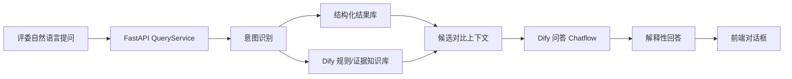

# 评优结果问答对话框设计

## 1. 总体判断

“电商问数”项目比 DeepSearch 更贴近我们要做的“评审结果出来后，评委在对话框里追问为什么”的能力。

它的核心思路是：

> 用户不是直接问大模型，而是先把问题转成可检索、可查询、可追踪的上下文，再让模型回答。

这套思路可以迁移成我们的“评优结果问答”。

## 2. 最值得借鉴的 6 点

### 2.1 从“问数”改成“问评审结果”

电商问数的链路是：

```text
自然语言问题 -> 找字段/指标/字段值 -> 生成 SQL -> 执行 -> 返回结果
```

我们的链路可以改成：

```text
自然语言问题 -> 找奖项/候选人/评分项/证据 -> 查询评审结果库 -> 检索规则和证据 -> 返回解释
```

### 2.2 多路召回

电商问数第 11 章把问题拆成字段、指标、字段取值三路召回。

我们可以拆成：

- 奖项规则召回：X 奖项看哪些标准
- 候选人结果召回：A、B 的总分、分项得分、排名
- 证据召回：申报理由、规则命中、缺失材料、风险提示
- 相似候选召回：是否存在重复申报或同类成果

### 2.3 召回后先合并，不直接丢给模型

电商问数第 12 章强调：召回结果不能直接给模型，要先合并成结构化上下文。

我们的评优问答也应该生成类似结构：

```yaml
award: 优秀融资贡献奖
candidates:
  - name: A
    total_score: 86
    strengths:
      - 融资金额明确
      - 条款对比充分
    missing_evidence:
      - 无明显缺口
  - name: B
    total_score: 72
    strengths:
      - 战略意义有描述
    missing_evidence:
      - 缺少融资金额证明
      - 缺少条款优劣对比
rules:
  - 融资金额
  - 条款优劣
  - 战略意义
  - 方案创新性
comparison_focus:
  - 量化证据差异
  - 规则命中差异
  - 风险和缺口差异
```

### 2.4 过滤上下文，减少模型胡说

电商问数第 13 章有一个很好的原则：

> 让模型从候选上下文里“选择”，不要让模型重写完整结构。

我们可以先让模型判断用户问题类型：

- 对比解释
- 分数解释
- 证据追问
- 规则追问
- 风险追问
- 排名追问

然后 FastAPI 只取相关数据给 Dify Chatflow。

### 2.5 查询与校验闭环

电商问数第 14 章是 SQL 生成、校验、纠错、执行闭环。

我们不一定要让模型生成 SQL，但可以借鉴“执行前校验”：

- 查不到 A 或 B，要先澄清；
- X 奖项不存在，要提示；
- A/B 不属于同一奖项，要说明不能直接比较；
- 如果人工评委改过分，要优先解释人工最终结果，而不是模型原始建议。

### 2.6 SSE 与日志追踪

电商问数第 15-17 章用 FastAPI + SSE 返回进度、结果、错误。

我们的对话框也可以这样显示：

- 正在识别问题意图
- 正在查询候选人评审包
- 正在检索奖项规则
- 正在生成对比解释
- 回答完成

## 3. 推荐对话框架构



## 4. 分工建议

### 4.1 Dify 负责

- LLM
- 规则/证据知识库
- embedding
- rerank
- 解释生成

### 4.2 FastAPI 负责

- 识别用户提到的奖项和候选人
- 查询结构化评审结果
- 组装候选对比上下文
- 记录请求日志
- 返回过程事件

### 4.3 前端负责

- 对话框
- 过程展示
- 候选详情跳转
- 引用证据展示
- 错误提示与澄清交互

## 5. 可以直接参考的章节

- [2-项目整体架构与智能体流程](https://github.com/didilili/ai-agents-from-zero/tree/main/%E5%AE%9E%E6%88%98%E9%A1%B9%E7%9B%AE-%E7%94%B5%E5%95%86%E9%97%AE%E6%95%B0)：离线知识构建 + 在线问答链路
- [11-关键词抽取与多路召回](https://github.com/didilili/ai-agents-from-zero/tree/main/%E5%AE%9E%E6%88%98%E9%A1%B9%E7%9B%AE-%E7%94%B5%E5%95%86%E9%97%AE%E6%95%B0)：自然语言问题如何拆成多路检索
- [12-召回信息合并与上下文构建](https://github.com/didilili/ai-agents-from-zero/tree/main/%E5%AE%9E%E6%88%98%E9%A1%B9%E7%9B%AE-%E7%94%B5%E5%95%86%E9%97%AE%E6%95%B0)：把检索结果整理成模型可用上下文
- [13-SQL生成前的信息过滤与补全](https://github.com/didilili/ai-agents-from-zero/tree/main/%E5%AE%9E%E6%88%98%E9%A1%B9%E7%9B%AE-%E7%94%B5%E5%95%86%E9%97%AE%E6%95%B0)：上下文精筛
- [17-前后端联调与日志追踪](https://github.com/didilili/ai-agents-from-zero/tree/main/%E5%AE%9E%E6%88%98%E9%A1%B9%E7%9B%AE-%E7%94%B5%E5%95%86%E9%97%AE%E6%95%B0)：对话框进度、错误、日志追踪

## 6. 一句话总结

这个项目最适合借鉴的是：

```text
自然语言问题 -> 多路召回 -> 结构化上下文 -> 可追踪回答
```

我们把 SQL 换成评审结果，把字段/指标换成奖项/候选人/证据，就能做出一个扎实的评优解释对话框。
