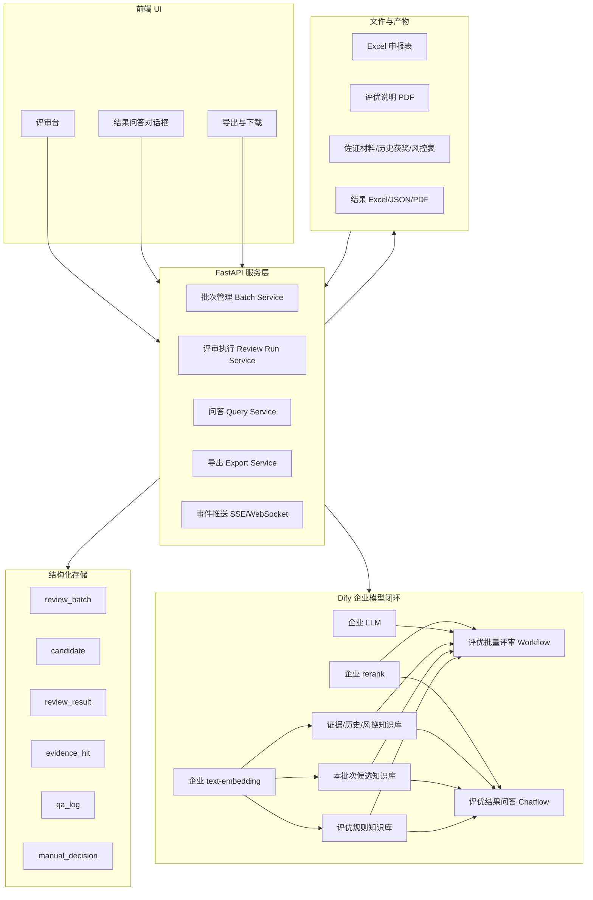
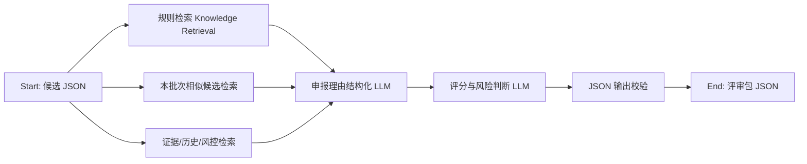
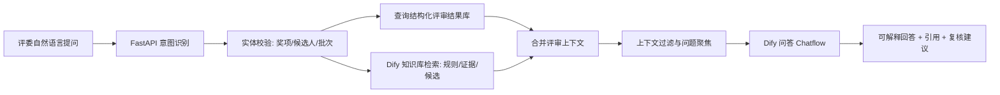

# 评优辅助智能体项目技术路线与架构细节

## 0. 给 Claude 的上下文速览

本项目目标是为 2025 年度评优工作建设一个“评优辅助智能体”，帮助评委对优秀小组、个人、团队等奖项进行材料质检、规则匹配、证据检索、辅助评分、排序解释和结果问答。

当前已知约束：

- Excel 申报表字段不会再新增，系统必须基于现有字段实战使用。
- 现有 Excel 字段包括：申报批次、申报项目、所属 BG/AMC、所属 BU、公司、申报主体、姓名、主要职务、推荐人姓名、提报结果、最后更新时间、筛选人/对接人、申报理由。
- 现有 PDF《2025 年度评优说明》包含 25 个奖项、通用评优原则和评优时间表。
- 评优说明中的通用原则包括：事迹要结合价值创造且有典型性、业绩贡献可量化、优中选优、宁缺毋滥、同等情况下向一线/海外倾斜、同一成果不可重复申报多个奖项、历年已获表彰团队不因相同成果重复获奖、风控排查一票否决。
- 用户已有 Dify，并且 Dify 上配置了企业内的 LLM、text-embedding、rerank 等模型。为了保护公司隐私，应优先使用 Dify 企业模型闭环，而不是调用外部公开模型。
- 后期会补充 FastAPI 和前端 UI，因此第一版要保留清晰的服务化扩展路径。
- 最新补充：最终业务交付不是“材料质检清单”，而是一个评选结果名单 Excel，格式参考 `评选结果输出格式.xlsx`。该结果表字段为：序号、奖项名称、主体、所属BU、提报人、团队负责人、团队成员、事迹。

关键结论：

> 本项目不应做“自动决定获奖”的智能体，而应做“评优辅助与解释智能体”。系统负责把申报材料变成可比较、可追溯、可复核的评审包；最终获奖仍由评委和评审会决定。

### 0.1 最新方向确认：最终产物是评选结果名单，不是质检表

Claude 曾建议第一版完全收敛为“材料质检工具”，只输出证据强弱、缺失材料和人工复核点，不做评分、不做排序、不做推荐名单。这个建议在治理风险上有价值，但与当前业务交付目标不完全匹配。

当前用户明确给出的最终输出文件是 `评选结果输出格式.xlsx`，它不是质检表，而是评选结果名单：

| 序号 | 奖项名称 | 主体 | 所属BU | 提报人 | 团队负责人 | 团队成员 | 事迹 |
| --- | --- | --- | --- | --- | --- | --- | --- |

因此，本项目需要保留“奖项内筛选、排序、拟推荐名单生成、结果解释”的能力。否则无法自动产出最终结果表，也无法支持后续评委追问“为什么 X 奖项进入名单的是 A 而不是 B”。

但 Claude 的部分治理建议仍应吸收，方式是做“双层输出”：

1. **内部评审包**：保存评分、证据等级、规则命中、缺失材料、风险提示、相似候选、Dify 检索来源等，用于排序、解释、审计和人工复核。
2. **最终结果表**：只导出入选或拟入选名单，字段严格贴合 `评选结果输出格式.xlsx`，不直接展示总分、权重、模型置信度等容易引发争议的内容。

这意味着本项目定位应表述为：

> 评优结果生成与解释智能体：系统基于规则和申报材料生成内部评审依据，辅助形成拟推荐名单，并导出指定格式的评选结果表；评委保留最终确认、调整和否决权。

### 0.2 对 Claude 建议的取舍

建议采纳：

- 规则命中必须可追溯到 `rule_id`、PDF 页码、chunk_id。
- 缺失材料应区分严重程度，例如 P0/P1/P2。
- 最终回答和导出应避免出现“AI 决定获奖”的措辞。
- 一线/海外倾斜不应做固定加分，应作为同等情况下的提示标签或 tie-breaker。
- Dify 输出 JSON 需要用程序校验和重试机制保证稳定。
- 日志、导出和问答都要做隐私与审计控制。

不建议采纳为第一目标：

- 不输出拟推荐名单。
- 完全取消评分或排序。
- 将 MVP 收敛为只导出质检表。

更适合本项目的折中方案：

- 后台可以保留评分、等级和排序逻辑，用于形成拟推荐名单。
- 最终 Excel 不暴露评分细节，只输出业务需要的结果字段。
- 问答对话框解释的是“当前证据和规则下为什么该主体进入拟推荐名单”，而不是宣称“系统决定获奖”。
- 评委可以基于内部评审包进行人工确认、替换、删除和补充。

### 0.3 最终结果表字段映射要求

由于最终输出字段和原始申报 Excel 并非一一对应，智能体还需要做字段抽取和映射：

| 最终结果字段 | 来源与生成方式 |
| --- | --- |
| 序号 | 按最终名单顺序自动生成 |
| 奖项名称 | 来自原始 Excel 的申报项目，按奖项分组；同一奖项可合并单元格 |
| 主体 | 优先从申报主体、项目/团队名称、姓名中判断；团队奖优先输出团队/项目/部门主体，个人奖输出姓名 |
| 所属BU | 来自原始 Excel 的所属 BU |
| 提报人 | 可来自原始 Excel 的筛选人/对接人、推荐人姓名，或按业务规则映射 |
| 团队负责人 | 原始 Excel 无此字段，需从申报理由中抽取；抽不到时填“待补充” |
| 团队成员 | 原始 Excel 无此字段，需从申报理由中抽取；抽不到时填“待补充” |
| 事迹 | 从申报理由中压缩改写，形成适合评审会阅读的简洁事迹描述 |

因此，Dify Workflow 不仅要输出评分依据，还要输出结果表所需的结构化字段：

```json
{
  "award_name": "优秀融资贡献奖",
  "result_subject": "复星医药资金管理部",
  "bu": "医药总部",
  "submitter": "D",
  "team_leader": "D",
  "team_members": "xxxxxx",
  "achievement_summary": "事迹摘要",
  "internal_review": {
    "score": 86,
    "recommendation": "拟推荐",
    "matched_rules": [],
    "missing_evidence": [],
    "risk_flags": [],
    "explanation": "用于问答解释的内部依据"
  }
}
```

---

## 1. 已参考项目与可迁移思路

### 1.1 deepsearch-agents 可借鉴点

GitHub 项目：[didilili/deepsearch-agents](https://github.com/didilili/deepsearch-agents)

该项目强调一条完整 AI 应用工程链路：FastAPI 接收任务，主智能体分派子助手，调用网络、数据库、RAGFlow、上传文件等多来源工具，生成 Markdown/PDF，并通过 WebSocket 推送过程事件。

可迁移到本项目的点：

- 一主多从的工程分工：主编排器 + 规则检索 + 申报理解 + 证据检索 + 重复检测 + 报告生成。
- 多来源检索，而不是模型裸评。
- 长任务可观察：一批 Excel 评审不是秒级任务，前端需要看到处理进度。
- 会话级上下文隔离：用 batch_id、run_id、candidate_id、workflow_run_id 隔离任务。
- 文件交付链路：上传 Excel/PDF，导出结果 Excel、JSON、评审摘要、风险清单。

不建议照搬的点：

- 不建议第一版引入 DeepAgents。Dify Workflow 已经足够承担评审流程。
- 不需要 Tavily 网络搜索。评优材料涉及隐私，默认不要出内网。
- 不需要 RAGFlow。已有 Dify 知识库、企业 embedding 和 rerank。

### 1.2 电商问数项目可借鉴点

GitHub 项目：[ai-agents-from-zero / 实战项目-电商问数](https://github.com/didilili/ai-agents-from-zero/tree/main/%E5%AE%9E%E6%88%98%E9%A1%B9%E7%9B%AE-%E7%94%B5%E5%95%86%E9%97%AE%E6%95%B0)

该项目的主线是：

```text
自然语言问题
  -> 关键词抽取
  -> 字段 / 指标 / 字段值多路召回
  -> 召回结果合并为结构化上下文
  -> 上下文过滤与补全
  -> SQL 生成、校验、执行
  -> 前端展示过程和结果
```

对本项目最有价值的迁移：

```text
评委自然语言问题
  -> 意图识别
  -> 奖项 / 候选人 / 评分项 / 证据多路召回
  -> 合并为结构化评审上下文
  -> 过滤无关上下文
  -> Dify Chatflow 生成可解释回答
  -> 前端对话框展示依据、证据和差异
```

核心原则：

- 召回结果不能直接丢给模型，要先整理成结构化上下文。
- 召回阶段宁可多一些，过滤阶段再精简。
- 让模型做选择和解释，不让模型重写完整事实结构。
- 查询失败、候选不存在、奖项不一致等情况要走校验和澄清，不要强行回答。

### 1.3 Dify 能力边界

参考 Dify 文档：

- [Run Workflow API](https://docs.dify.ai/api-reference/workflows/run-workflow)：Workflow 发布后可通过 API 执行，支持 blocking/streaming。
- [Knowledge Retrieval Node](https://docs.dify.ai/en/use-dify/nodes/knowledge-retrieval)：用于在 Workflow/Chatflow 中检索知识库，并将检索结果作为下游 LLM 节点上下文。
- [Create Document by Text](https://docs.dify.ai/api-reference/documents/create-document-by-text)：可通过 API 将文本写入知识库，并指定 high_quality indexing、embedding 模型和 retrieval_model。
- [Create Document by File](https://docs.dify.ai/api-reference/documents/create-document-by-file)：可通过 API 上传 PDF、TXT、DOCX 等文件进入知识库。

本项目建议把 Dify 定位为“智能推理与 RAG 层”，而不是完整业务系统：

- Dify 负责 LLM、embedding、rerank、知识库检索、Workflow/Chatflow 编排。
- Python/FastAPI 负责 Excel 批处理、任务状态、结果入库、跨候选比较、导出、权限和前端接口。

---

## 2. 总体架构

### 2.1 系统分层



### 2.2 两条主线

本项目建议拆成两条主线：

1. 批量评审主线：Excel/PDF/证据材料进入系统，生成候选评审包、分数建议、风险提示和导出文件。
2. 结果问答主线：评审结果出来后，评委在对话框里用自然语言追问为什么、差异在哪里、证据是否充分。

这两条主线共享同一套结构化结果库和 Dify 知识库。

---

## 3. 数据与知识库设计

### 3.1 输入文件

当前固定输入：

- `sample_input.xlsx`：申报表，字段固定，不再新增。
- `2025年度评优说明_删除倒数第二页.pdf`：奖项规则、评选标准、原则和时间表。

后期可选输入：

- 历史获奖名单。
- 风控筛查结果。
- 佐证材料。
- 评委人工意见。
- 评审会最终决议。

### 3.2 Dify 知识库划分

建议至少建 3 个知识库：

| 知识库 | 内容 | 更新频率 | 用途 |
| --- | --- | --- | --- |
| 评优规则知识库 | PDF 中的奖项说明、评选标准、通用原则、时间表 | 低 | 规则匹配、评分依据、问答解释 |
| 本批次候选知识库 | 当前 Excel 每一行转成的候选文本和申报理由 | 每批次更新 | 重复申报检测、候选对比、问答定位 |
| 证据/历史/风控知识库 | 佐证材料、历史获奖、风控筛查 | 中 | 风险提示、证据补充、重复获奖检测 |

### 3.3 规则知识库切分建议

评优说明 PDF 不建议按页粗切，应按奖项结构化切分：

```yaml
document_type: award_rule
award_name: 优秀融资贡献奖
category: 战略共识
award_type: 团队奖
initial_review_unit:
  - 投融资
  - 财务
description: 在重大项目融资、创新融资、对接资本市场等方面有重大贡献，通过融资助力产业发展的团队。
criteria:
  - 基金融资以外部 LP 金额大小、比例以及基金条款优劣为核心。
  - 债务性融资、引战类融资以金额大小、比例以及条款优劣为核心。
  - 关注融资对集团的战略意义。
  - 关注单项融资方案是否科学合理、是否当前条件下最佳方案、是否行业首单或具有示范意义。
general_principles:
  - 价值创造要典型，业绩贡献可量化。
  - 优中选优，宁缺毋滥。
  - 同等情况下向一线/海外倾斜。
  - 同一成果不可重复申报多个奖项。
  - 风控一票否决。
```

### 3.4 候选知识库文本格式

Excel 字段不新增，但入库时可以把每行转换成结构化文本：

```yaml
document_type: candidate_submission
batch_name: 复星集团2025年度评优
award_name: 优秀融资贡献奖 Outstanding Financing Contribution Award
bg_amc: 大健康产业运营委员会 Health Industrial Operation Committee
bu: 复星医药 Fosun Pharma
company: 大健康产业运营委员会
submission_entity: 复星医药资金管理部
candidate_name: 刘小姐
role: 资金副总监
review_status: BU筛选 BU Review
last_updated: 2025-11-07 21:33:09
contact_person: 某人
submission_reason: 此处放申报理由全文
```

这样既不改变 Excel 字段，又能让 embedding/rerank 和 LLM 更好理解。

---

## 4. 批量评审 Workflow 设计

### 4.1 输入

Python/FastAPI 对每一行 Excel 组装成 Dify Workflow 输入：

```json
{
  "batch_id": "2025-awards-batch-001",
  "run_id": "run-20250608-001",
  "candidate_id": "cand-0001",
  "award_name": "优秀融资贡献奖 Outstanding Financing Contribution Award",
  "candidate_name": "刘小姐",
  "submission_entity": "复星医药资金管理部",
  "role": "资金副总监",
  "org_context": {
    "bg_amc": "大健康产业运营委员会",
    "bu": "复星医药",
    "company": "大健康产业运营委员会"
  },
  "submission_reason": "此处放申报理由全文"
}
```

### 4.2 Dify Workflow 节点建议



节点说明：

| 节点 | 作用 | embedding/rerank 使用 |
| --- | --- | --- |
| 规则检索 | 按申报项目和申报理由召回奖项规则、通用原则 | embedding 召回，rerank 精排 |
| 相似候选检索 | 查本批次是否有相似申报或同一成果 | embedding 召回，rerank 精排 |
| 证据/历史/风控检索 | 查佐证、历史获奖、风控材料 | embedding 召回，rerank 精排 |
| 申报理由结构化 | 从申报理由抽取成果、指标、时间、价值、创新、缺口 | LLM |
| 评分与风险判断 | 按规则输出建议评分、风险和复核点 | LLM |
| JSON 输出校验 | 保证输出字段完整，方便 FastAPI 入库 | 程序校验或 LLM 修正 |

### 4.3 建议输出 JSON

```json
{
  "candidate_id": "cand-0001",
  "award_name": "优秀融资贡献奖",
  "candidate_name": "刘小姐",
  "recommendation": "人工复核",
  "confidence": 0.68,
  "total_score": 74,
  "score_breakdown": {
    "rule_match": 18,
    "quantitative_evidence": 12,
    "value_impact": 28,
    "innovation_difficulty": 8,
    "frontline_overseas_factor": 4,
    "risk_penalty": -0
  },
  "matched_rules": [
    {
      "rule": "融资金额、比例以及条款优劣",
      "match_level": "partial",
      "evidence": "申报理由提到融资贡献，但未看到明确金额和条款对比。"
    }
  ],
  "evidence_summary": [
    "申报理由显示其参与重大融资工作。",
    "目前缺少融资金额、融资比例、条款优劣、战略意义的量化佐证。"
  ],
  "missing_evidence": [
    "融资金额",
    "融资比例",
    "条款优劣对比",
    "对集团或产业的战略意义说明",
    "是否行业首单或示范意义"
  ],
  "duplicate_risk": {
    "level": "unknown",
    "similar_candidates": []
  },
  "risk_flags": [],
  "reviewer_notes": [
    "建议补充融资金额、条款对比和集团层面价值说明后再进入最终排序。"
  ],
  "source_trace": {
    "dify_workflow_run_id": "xxx",
    "rule_chunks": [],
    "candidate_chunks": [],
    "evidence_chunks": []
  }
}
```

---

## 5. 评分框架

### 5.1 推荐默认权重

由于 Excel 字段固定且申报理由可能质量参差，第一版建议采用“可解释辅助评分”，而不是严格自动排名。

| 维度 | 权重 | 说明 |
| --- | ---: | --- |
| 规则匹配度 | 25% | 是否命中奖项评选标准 |
| 价值贡献 | 35% | 对收入、利润、现金流、效率、战略等价值的贡献 |
| 量化证据充分度 | 25% | 是否有金额、比例、同比、预算、行业对标、指标口径 |
| 创新性/难度/示范意义 | 10% | 是否行业首单、难度高、可复制、标杆意义 |
| 倾斜因素 | 5% | 同等情况下一线/海外优先 |

硬规则：

- 风控筛查触及底线时，一票否决。
- 同一成果不可重复申报多个奖项。
- 历年已获表彰团队不得因同一成果重复获奖。
- 证据不足时降低 confidence，不应给出过度确定结论。

### 5.2 奖项专属评分

如果奖项规则本身有明确算法，应优先使用专属算法。例如优秀退出贡献奖规则中包含红黄绿灯退出评分、一二级项目退出评分、已回收现金评分、IRR 评分，各 25% 权重，则应按该规则覆盖默认权重。

---

## 6. 结果问答对话框设计

### 6.1 使用场景

评审结果出来后，评委可以在对话框里自然语言提问：

- 为什么系统建议 A 在 X 奖项下优先于 B？
- A 的主要加分点是什么？
- B 缺少哪些材料？
- 这个奖项最看重量化指标还是创新性？
- 哪些候选有重复申报风险？
- 如果 B 补充融资金额证明，是否可能超过 A？
- 为什么某个候选被标记为人工复核？

建议回答措辞：

> 系统建议 A 在 X 奖项下优先于 B，主要因为……

避免说：

> 系统把 X 奖项颁给了 A。

最终颁奖应由人工评委决定，系统只解释辅助建议。

### 6.2 问答链路



### 6.3 意图类型

| 意图 | 示例 | 需要的数据 |
| --- | --- | --- |
| 对比解释 | 为什么 A 高于 B？ | A/B 分项得分、规则命中、证据、缺口 |
| 分数解释 | 为什么 A 是 86 分？ | A 的评分拆解、证据、规则 |
| 证据追问 | A 的融资金额证据在哪里？ | evidence_hit、申报理由、佐证材料 |
| 规则追问 | 优秀融资贡献奖看什么？ | award_rule |
| 风险追问 | 谁有重复申报风险？ | duplicate_risk、similar_candidates |
| 改分影响 | B 补材料后能否超过 A？ | 当前分差、缺口、评分规则 |
| 排名追问 | X 奖项当前前三是谁？ | award ranking、confidence、manual decision |

### 6.4 问答上下文 YAML 示例

```yaml
question: 为什么优秀融资贡献奖建议 A 优先于 B？
intent: comparison_explanation
award:
  name: 优秀融资贡献奖
  key_rules:
    - 融资金额、比例以及条款优劣
    - 对集团战略意义
    - 方案科学合理或行业首单示范意义
general_principles:
  - 贡献可量化
  - 优中选优，宁缺毋滥
  - 同一成果不可重复申报
candidates:
  - name: A
    rank: 1
    total_score: 86
    score_breakdown:
      rule_match: 23
      quantitative_evidence: 21
      value_impact: 31
      innovation_difficulty: 8
      frontline_overseas_factor: 3
    strengths:
      - 融资金额明确
      - 条款优劣有对比
      - 战略意义有量化说明
    missing_evidence: []
    risk_flags: []
  - name: B
    rank: 3
    total_score: 72
    score_breakdown:
      rule_match: 18
      quantitative_evidence: 10
      value_impact: 27
      innovation_difficulty: 7
      frontline_overseas_factor: 3
    strengths:
      - 战略意义有描述
    missing_evidence:
      - 缺少融资金额证明
      - 缺少条款优劣对比
    risk_flags: []
answer_requirements:
  - 先给结论，再给依据
  - 明确说明这是系统辅助建议，不是最终颁奖决定
  - 解释分差来源
  - 给出人工复核建议
```

### 6.5 对话框回答格式

建议固定为：

```text
结论：
系统建议 A 在 X 奖项下优先于 B，主要因为……

规则依据：
X 奖项重点看……

A 的优势：
1. ...
2. ...

B 的不足：
1. ...
2. ...

分差来源：
主要差在……

人工复核建议：
如果评委认为 B 的某项材料已补充，应重点复核……

说明：
以上为系统辅助解释，最终获奖结果以评审会决议为准。
```

---

## 7. FastAPI 设计

### 7.1 第一阶段可先脚本化

第一版可以不立刻做 FastAPI，先做离线脚本：

```text
parse_rules.py      # 解析 PDF 规则，生成规则文本/JSON
ingest_rules.py     # 导入 Dify 规则知识库
parse_excel.py      # 读取 Excel，生成 candidate JSON
ingest_batch.py     # 导入本批次候选知识库
run_review.py       # 逐行调用 Dify Workflow
export_results.py   # 导出 Excel/JSON/PDF
```

### 7.2 第二阶段 FastAPI 接口

建议接口：

| 接口 | 方法 | 说明 |
| --- | --- | --- |
| `/health` | GET | 健康检查 |
| `/review-batches/upload` | POST | 上传 Excel/PDF/佐证材料 |
| `/review-batches/{batch_id}` | GET | 查询批次信息 |
| `/review-runs/start` | POST | 启动评审任务 |
| `/review-runs/{run_id}/status` | GET | 查询任务状态 |
| `/review-runs/{run_id}/events` | GET | SSE 事件流 |
| `/candidates` | GET | 候选列表 |
| `/candidates/{candidate_id}` | GET | 候选详情 |
| `/candidates/{candidate_id}/approve` | POST | 评委确认、改分、备注 |
| `/qa/query` | POST | 结果问答 |
| `/qa/events/{qa_id}` | GET | 问答过程 SSE |
| `/exports/{run_id}` | GET | 导出结果文件 |

### 7.3 事件协议

借鉴电商问数项目，建议统一三类事件：

```json
{
  "type": "progress",
  "run_id": "run-001",
  "step": "规则检索",
  "status": "running",
  "candidate_id": "cand-0001",
  "message": "正在检索优秀融资贡献奖规则"
}
```

```json
{
  "type": "result",
  "run_id": "run-001",
  "candidate_id": "cand-0001",
  "data": {
    "recommendation": "人工复核",
    "total_score": 74
  }
}
```

```json
{
  "type": "error",
  "run_id": "run-001",
  "candidate_id": "cand-0001",
  "message": "Dify Workflow 返回 JSON 解析失败"
}
```

### 7.4 后端服务模块

```text
app/
  api/
    routers/
      batch_router.py
      review_router.py
      candidate_router.py
      qa_router.py
      export_router.py
    schemas/
      batch_schema.py
      review_schema.py
      qa_schema.py
  services/
    batch_service.py
    rule_ingestion_service.py
    candidate_ingestion_service.py
    review_run_service.py
    qa_service.py
    export_service.py
  repositories/
    batch_repository.py
    candidate_repository.py
    review_result_repository.py
    evidence_repository.py
    qa_log_repository.py
  clients/
    dify_client.py
  core/
    config.py
    logging.py
    security.py
    events.py
```

---

## 8. 数据库表建议

### 8.1 批次表

```sql
review_batch(
  id,
  name,
  source_excel_path,
  source_rule_pdf_path,
  status,
  created_at,
  updated_at
)
```

### 8.2 候选表

```sql
candidate(
  id,
  batch_id,
  row_number,
  award_name,
  bg_amc,
  bu,
  company,
  submission_entity,
  candidate_name,
  role,
  recommender_name,
  submission_status,
  last_updated_at,
  contact_person,
  submission_reason,
  normalized_text,
  created_at
)
```

### 8.3 评审结果表

```sql
review_result(
  id,
  run_id,
  candidate_id,
  award_name,
  recommendation,
  total_score,
  confidence,
  score_breakdown_json,
  matched_rules_json,
  evidence_summary_json,
  missing_evidence_json,
  duplicate_risk_json,
  risk_flags_json,
  reviewer_notes_json,
  dify_workflow_run_id,
  created_at
)
```

### 8.4 人工决策表

```sql
manual_decision(
  id,
  candidate_id,
  reviewer_id,
  manual_score,
  manual_status,
  comment,
  locked,
  created_at,
  updated_at
)
```

### 8.5 问答日志表

```sql
qa_log(
  id,
  batch_id,
  run_id,
  user_id,
  question,
  intent,
  entities_json,
  context_json,
  answer,
  dify_conversation_id,
  created_at
)
```

---

## 9. 前端 UI 设计

### 9.1 评审台

核心布局：

- 左侧：奖项筛选、候选列表、状态筛选。
- 中间：候选详情、申报理由、核心成果摘要。
- 右侧：规则命中、分项评分、证据摘要、缺失材料、风险提示。
- 底部或侧边：评委改分、备注、锁定最终意见。

### 9.2 结果问答对话框

对话框上下文应支持：

- 当前批次。
- 当前奖项。
- 当前候选人。
- 当前对比对象。
- 当前评审结果版本。

前端可提供快捷提问：

- 为什么这个候选建议入围？
- 和同奖项第二名相比，优势在哪里？
- 缺少哪些材料？
- 有重复申报风险吗？
- 这个分数的主要依据是什么？

### 9.3 过程可观察

批量评审时展示：

- 已处理候选数 / 总候选数。
- 当前候选。
- 当前节点。
- Dify Workflow 状态。
- 失败候选列表。

问答时展示：

- 正在识别问题意图。
- 正在查询评审结果。
- 正在检索奖项规则。
- 正在生成解释。
- 回答完成。

---

## 10. 隐私、安全与治理

### 10.1 隐私原则

- 企业 LLM、embedding、rerank 必须走 Dify 内部模型配置。
- FastAPI 不把申报理由、姓名、风控信息发给外部模型。
- 日志不记录完整申报理由和敏感风控内容，只记录 candidate_id、run_id、workflow_run_id、状态和错误码。
- 前端下载结果需权限控制。

### 10.2 模型治理

- Dify Workflow 和 Chatflow 都要版本化。
- 每次评审结果记录 Dify workflow_run_id。
- 每次问答记录 dify_conversation_id 或请求 ID。
- 评分 Prompt、规则知识库版本、模型版本应写入 run metadata。

### 10.3 人工复核

系统输出必须包含：

- recommendation：建议入围 / 待补材料 / 人工复核 / 不建议入围。
- confidence：置信度。
- missing_evidence：缺失材料。
- reviewer_notes：人工复核建议。

不要只给总分。

---

## 11. 分阶段技术路线

### 11.1 第一阶段：离线脚本版

目标：不做前端，不做 FastAPI，先验证 Dify Workflow 能否稳定评审 Excel。

工作内容：

1. 解析 PDF，生成结构化奖项规则 JSON 和规则知识库文本。
2. 通过 Dify API 导入评优规则知识库。
3. 解析 Excel，逐行生成 candidate JSON。
4. 将本批次候选文本导入 Dify 本批次候选知识库。
5. Python 逐行调用 Dify Workflow。
6. 收集 Workflow 输出并校验 JSON。
7. 导出 `review_result.xlsx`、`candidate_review_cards.json`、`missing_evidence.xlsx`、`duplicate_risk.xlsx`。

验收标准：

- 每条 Excel 都能输出结构化评审包。
- 规则引用准确。
- 缺失材料能被识别。
- 相似候选能被标记。
- 结果可导出并人工复核。

### 11.2 第二阶段：FastAPI 服务版

目标：把脚本能力服务化。

工作内容：

1. 增加批次管理。
2. 增加评审任务启动与状态查询。
3. 增加 SSE/WebSocket 过程事件。
4. 增加候选详情接口。
5. 增加评委改分、备注、锁定。
6. 增加导出接口。
7. 增加问答接口。

验收标准：

- 支持上传一批 Excel 并启动任务。
- 前端或 API 能看到实时进度。
- 支持查询候选评审包。
- 支持自然语言问答解释评审结果。

### 11.3 第三阶段：前端评审台

目标：让评委真正可用。

工作内容：

1. 候选列表与奖项筛选。
2. 候选详情与评分解释。
3. 风险、缺失材料、重复申报提示。
4. 评委人工改分与备注。
5. 评审结果问答对话框。
6. 导出评审会材料。

验收标准：

- 评委可以按奖项查看排序。
- 评委可以追问“为什么 A 优先于 B”。
- 评委可以查看规则依据和证据缺口。
- 评委可以修改并锁定最终意见。

### 11.4 第四阶段：治理增强

目标：提升稳定性、审计性和组织落地能力。

工作内容：

- 用户权限。
- 审计日志。
- Dify Workflow 版本管理。
- Prompt 评测集。
- 批次对比。
- 风控系统对接。
- 历史获奖库对接。
- 多评委协同。

---

## 12. 核心风险与建议

| 风险 | 表现 | 建议 |
| --- | --- | --- |
| Excel 字段少 | 只有申报理由承载主要信息 | 强化申报理由结构化和缺失材料识别 |
| 申报理由质量不一 | 候选之间不可比 | 输出 confidence 和 missing_evidence，不强行高置信排名 |
| 模型过度判断 | 把辅助建议说成最终颁奖 | 所有回答固定声明“系统辅助建议，最终以评审会为准” |
| 重复申报误报 | 语义相似但实际不同 | duplicate_risk 只做风险，不做自动否决 |
| Dify 知识库更新慢 | 批次候选导入后索引未完成 | 导入后轮询 indexing status，再启动评审 |
| Prompt 版本不稳定 | 同一候选多次结果差异 | 记录 Workflow 版本、模型版本、Prompt 版本 |
| 隐私泄露 | 日志或外部模型暴露敏感材料 | 内网模型闭环、日志脱敏、API Key 仅服务端保存 |

---

## 13. 推荐交付物

第一阶段交付：

- `评优规则结构化.json`
- `candidate_inputs.jsonl`
- `review_result.xlsx`
- `评选结果输出格式.xlsx` 或同格式导出文件
- `candidate_review_cards.json`
- `missing_evidence.xlsx`
- `duplicate_risk.xlsx`
- `review_run_summary.md`

第二阶段交付：

- FastAPI 服务。
- Dify Client。
- 数据库 schema。
- 任务事件流。
- API 文档。

第三阶段交付：

- 前端评审台。
- 问答对话框。
- 导出中心。

---

## 14. 最终建议

推荐路线：

```text
Dify 负责智能能力
Python/FastAPI 负责工程编排
数据库负责结构化结果和审计
前端负责评委体验
```

推荐第一版最小闭环：

```text
Excel + PDF
  -> Python 解析
  -> Dify 规则知识库 / 候选知识库
  -> Dify 批量评审 Workflow
  -> Python 汇总内部评审包
  -> 奖项内排序与拟推荐名单
  -> 人工确认 / 调整
  -> 导出指定格式的评选结果 Excel
```

第一版应同时保留两类产物：

- **内部评审包**：包含评分、证据等级、规则命中、缺失材料、风险提示和解释依据，用于问答、审计和人工调整。
- **最终结果表**：严格贴合 `评选结果输出格式.xlsx`，只展示序号、奖项名称、主体、所属BU、提报人、团队负责人、团队成员、事迹，不直接暴露模型分数和权重。

推荐第二版增强闭环：

```text
评审结果
  -> 结构化结果库
  -> 评优结果问答 Chatflow
  -> 评委自然语言追问
  -> 系统解释规则、证据、分差和复核点
```

一句话总结：

> 这个项目的核心不是让大模型“最终决定谁获奖”，而是让系统基于规则和申报材料生成拟推荐名单，并把每个入选主体为什么被推荐、证据是否充分、差异在哪里、风险在哪里解释清楚；最终名单仍由评委确认后导出为指定格式的评选结果表。
