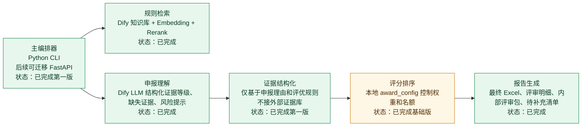
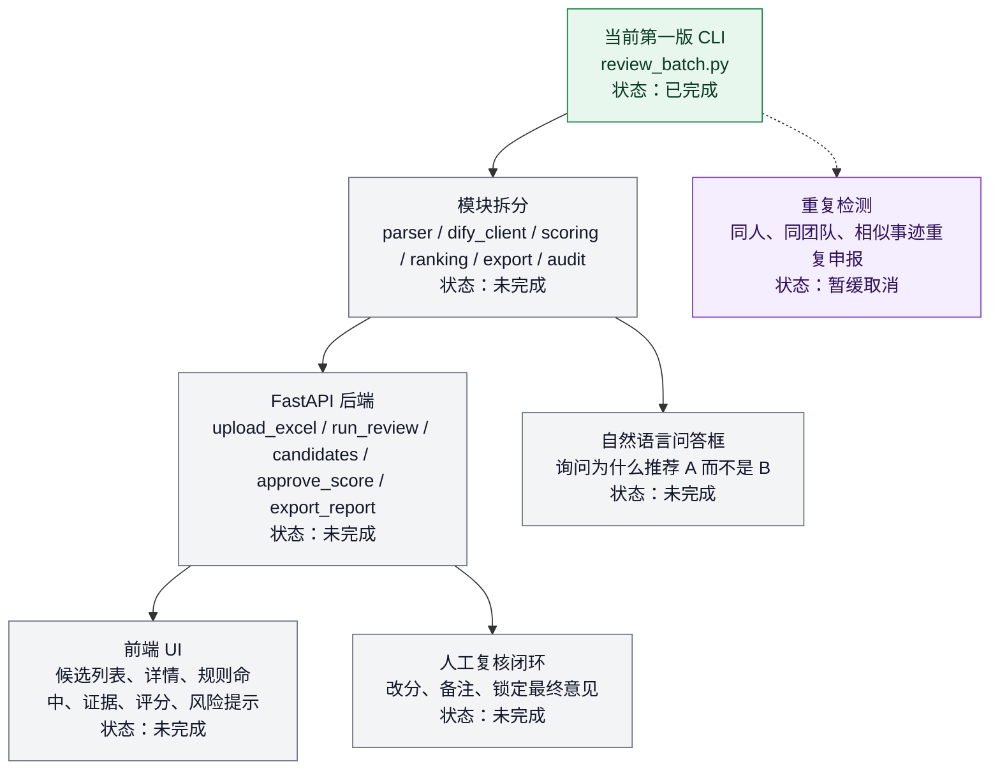

# 评优辅助智能体项目流程图与完成状态

生成日期：2026-06-09

## 状态图例

| 状态 | 含义 |
|---|---|
| 已完成 | 已经搭建并通过真实 Excel 验证 |
| 部分完成 | 第一版可用，但还有质量、配置或工程化增强空间 |
| 未完成 | 尚未开发 |
| 暂缓 | 当前版本明确不做，后续如有需要再加入 |

## 第一版主流程

```mermaid
flowchart TD
    A["真实 Excel 输入<br/>集团评优提报截止1111.xlsx<br/>状态：已完成"]:::done
    B["Python 主编排器<br/>读取 Excel、逐行生成 candidate_id、组织 Dify 输入<br/>状态：已完成"]:::done
    C["字段标准化与脱敏<br/>申报理由脱敏、原始行 JSON 保留、占位文本识别<br/>状态：已完成"]:::done
    D["Dify Workflow App<br/>评优候选人评审工作流<br/>状态：已完成"]:::done

    D1["规则检索节点<br/>从评优规则知识库召回规则<br/>Embedding：bge-m3<br/>Rerank：已启用<br/>状态：已完成"]:::done
    D2["申报理解节点<br/>根据申报理由判断证据强弱<br/>输出 review_result_json<br/>状态：已完成"]:::done
    D3["名单字段抽取节点<br/>抽取主体、提报人、负责人、成员、事迹<br/>输出 final_fields_json<br/>状态：已完成"]:::done

    E["本地 JSON 解析与容错<br/>自动处理模型输出中的 think 文本、代码块、额外说明<br/>状态：已完成"]:::done
    F["本地评分排序<br/>LLM 不直接决定获奖人<br/>Python 按 award_config 计算内部分数和排序<br/>状态：已完成"]:::done
    G["拟推荐名单生成<br/>默认每奖项 Top 2<br/>needs_review 不进入最终名单<br/>状态：已完成"]:::done
    H["Excel 和评审包导出<br/>最终名单、评审明细、internal_review_pack、待补充清单<br/>状态：已完成"]:::done
    I["真实数据全量验证<br/>41 条候选，21 条拟推荐，6 条待复核，14 条未入选<br/>状态：已完成"]:::done

    A --> B --> C --> D
    D --> D1 --> D2 --> D3 --> E --> F --> G --> H --> I

    classDef done fill:#E7F7EE,stroke:#16834A,color:#0B3B21,stroke-width:1px;
    classDef partial fill:#FFF7E6,stroke:#C97900,color:#4D2B00,stroke-width:1px;
    classDef todo fill:#F3F4F6,stroke:#6B7280,color:#111827,stroke-width:1px;
    classDef paused fill:#F4EEFF,stroke:#7C3AED,color:#2E1065,stroke-width:1px;
```

## 当前工程分工

## 已完成清单

| 模块 | 完成情况 | 说明 |
|---|---|---|
| 评优规则 Markdown | 已完成 | 已把 PDF 规则整理为 `2025年度评优规则_知识库版.md` |
| Dify 知识库 | 已完成 | 规则已上传，可通过 embedding/rerank 做规则召回 |
| Dify Workflow | 已完成 | 包含规则检索、证据评审、名单字段抽取、Output 节点 |
| Workflow API Key | 已完成 | 已使用 `DIFY_REVIEW_WORKFLOW_API_KEY` 调通 |
| Python 批量调用 | 已完成 | `review_batch.py` 可读取 Excel 并逐行调用 Dify |
| 真实 Excel 读取 | 已完成 | 已读取 `集团评优提报截止1111.xlsx`，共 41 条候选 |
| JSON 容错解析 | 已完成 | 可处理模型输出中夹带 `<think>`、代码块、额外说明的情况 |
| 内部评分排序 | 已完成基础版 | LLM 只输出证据等级，Python 负责打分和排序 |
| 最终名单 Excel | 已完成 | 输出字段符合模板：序号、奖项名称、主体、所属BU、提报人、团队负责人、团队成员、事迹 |
| 评审明细 Sheet | 已完成 | 保留分数、状态、缺失证据、风险、解释、原始 JSON |
| 内部评审包 | 已完成 | `internal_review_pack_*.jsonl` 可追溯每个候选人的证据和评分 |
| 待补充清单 | 已完成 | 自动标记负责人、团队成员、事迹、附件内容等需人工复核字段 |
| 真实全量验证 | 已完成 | 41 条中 21 条拟推荐，6 条待复核，14 条未入选 |

## 部分完成清单

| 模块 | 当前情况 | 后续建议 |
|---|---|---|
| `award_config.json` | 已有默认 Top 2 和默认权重 | 后续按每个奖项单独配置名额和权重 |
| 评分规则 | 已能把 strong、medium、weak、missing 换算为分数 | 后续需要业务方确认权重是否合理 |
| H 列事迹生成 | 已由 Dify 根据申报理由总结，遇到占位文本会填待补充 | 后续可微调成更统一的表彰口径 |
| 风险识别 | 已能识别证据缺失、类型错配、关键指标缺失等 | 后续可增加更明确的一票否决规则 |
| 数据质量处理 | 已发现并保留源数据异常，例如 `所属BU=False` | 后续可增加源数据校验报告 |
| 工程结构 | 目前仍是单文件脚本 | 后续接 FastAPI 前建议拆成多模块 |

## 未完成清单

## 下一步建议

1. 先让业务方查看 `review_results_20260609_095202_reparsed.xlsx` 的拟推荐名单，确认排序方向是否符合直觉。
2. 根据业务反馈调整 `award_config.json`，尤其是每个奖项名额和评分权重。
3. 增加源数据质量检查，例如 `所属BU=False`、`请见附件`、团队成员缺失、负责人不明确。
4. 再做工程拆分，为后续 FastAPI 和前端 UI 做准备。
5. 重复检测模块第一版暂缓，不进入当前开发范围。
